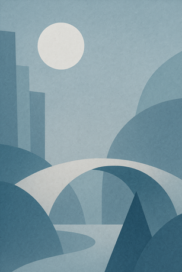

# Chapter One: Paper Bridges

The moon hums through cardboard windows while umbrellas evaporate politely.
Footsteps collect in jars like postcards of thunder. A teacup invents a staircase,
and the staircase applauds. Everything continues to almost begin.
